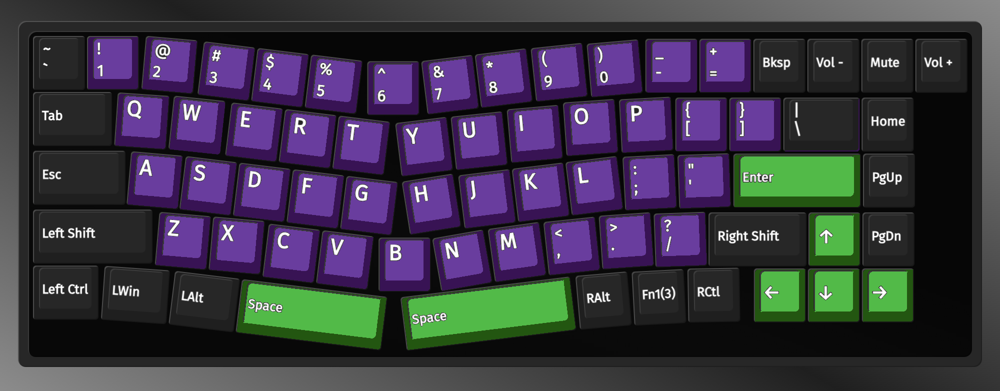
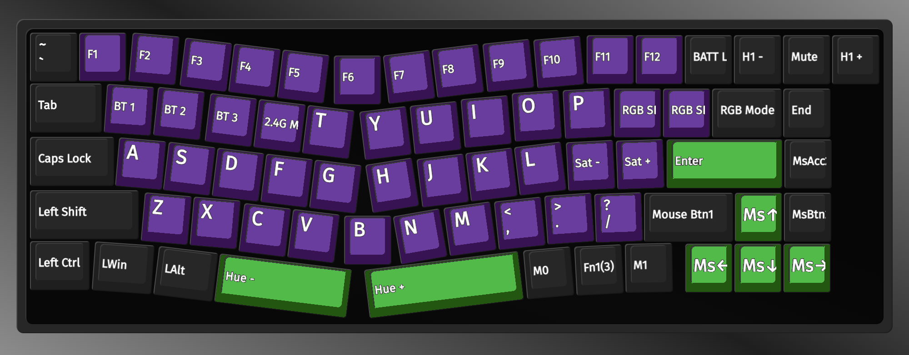

# a-jazz/attack shark/mambasnake AKS068 VIA config files

these are the VIA json programming files for both the regular [wired](https://amzn.to/3WEuj2R) and [tri-mode](https://amzn.to/3WqCIpa) pro versions of the AKS068 keyboard.

here's my current 2 layer layout:

tested on macos using the [via web app](http://usevia.app), here's a great [tutorial](https://epomaker.com/blogs/guides/how-to-use-via-for-beginners). unser settings, enable the `design` option. since this keeb uses a hacky implementation of the standard, ensure you enabled the `Use V2 definitions (deprecated)` option when loading the [via.json](AKS068-via-usb.json) files. there's a discrete config for both wired/bluetooth and 2.4g modes for some reason. once the config is loaded you can import my [custom layout](AKS068-layout.json) or use the designer to create your own.
